# AI Wallpaper Generator 🎨

<div align="center">


A powerful tool for generating stunning AI wallpapers using Google's Imagen 3 model via the Gemini API. Create beautiful, customized desktop wallpapers with advanced artistic and technical controls.

[Installation](#installation) • [Usage](#usage) • [Features](#features) • [Documentation](#documentation)

</div>

## Features

### AI Generation
- Powered by Google's Imagen 3 model via Gemini API
- Multiple prompt generation methods:
  - AI-powered prompts (Gemini)
  - Random tag combinations
  - Custom prompt input
  - Enhanced prompts with user preferences

### Generation Modes
- AI Generation with Gemini
- Random Tag Generation
- Custom Prompt Generation
- Advanced Options for fine-tuning

### Style Settings
- Multiple artistic styles:
  - Photorealistic
  - Digital Art
  - Sketch
  - Watercolor
  - Cyberpunk
  - Pop Art
  - Oil Painting
  - Pixel Art
  - Anime
  - 3D Render
- Art movements:
  - Abstract Expressionism
  - Impressionism
  - Surrealism
  - Minimalism
  - Cubism
- Post-processing effects
- Custom style options

### Camera & Technical Settings
- Camera models:
  - ARRI Alexa
  - RED Digital Cinema
  - Sony Venice
  - Custom options
- Lens options:
  - 50mm
  - 85mm
  - 24mm
  - Special lenses (tilt-shift, fisheye, macro)
- Aperture settings
- Depth of field control
- Resolution options (up to 8K)

### Lighting & Atmosphere
- Time of day settings
- Lighting styles:
  - Natural
  - Studio
  - Dramatic
  - Soft
  - Harsh
  - Volumetric
- Light quality options
- Artificial light sources
- Weather conditions
- Seasonal effects
- Atmospheric effects

### Composition & Environment
- Composition techniques:
  - Rule of thirds
  - Leading lines
  - Framing
  - Symmetry
  - Asymmetry
- Camera angles
- Perspective options
- Weather conditions
- Seasonal settings
- Atmospheric effects

### Color & Detail Settings
- Color schemes:
  - Natural
  - Warm
  - Cool
  - Monochromatic
  - Vibrant
  - Pastel
- Palette types:
  - Analogous
  - Complementary
  - Triadic
  - Split Complementary
- Color temperature
- Texture quality
- Special effects
- Detail levels

### Quality Settings
- Resolution options:
  - 1920x1080 (Full HD)
  - 2560x1440 (2K)
  - 3840x2160 (4K)
  - 5120x2880 (5K)
  - 7680x4320 (8K)
- Detail levels
- Rendering quality
- Texture quality

### Wallpaper Management
- Auto-setting wallpaper
- Cache management
- Multi-monitor support:
  - Mirror mode
  - Extend mode
  - Individual mode
- Fit modes:
  - Fill
  - Fit
  - Center
  - Tile
- Background color options
- Refresh rate settings:
  - Daily
  - Weekly
  - Monthly
  - Never

## 📋 Menu Structure

```mermaid
graph TD
    A[Main Menu] --> B[Generate AI Wallpaper]
    A --> C[Manage Preferences]
    A --> D[Manage Imagen 3 Settings]
    A --> E[Exit]
    
    B --> F[Use Gemini AI]
    B --> G[Use Random Prompt]
    B --> H[Custom Prompt]
    B --> I[Advanced Options]
    
    C --> J[Manage Genres]
    C --> K[Manage Styles]
    C --> L[Manage Moods]
    C --> M[Manage Wallpaper Settings]
    C --> N[View Current Preferences]
    C --> O[Reset to Defaults]
    
    D --> P[Style & Artistic Settings]
    D --> Q[Camera & Technical Settings]
    D --> R[Lighting & Atmosphere]
    D --> S[Composition & Environment]
    D --> T[Color & Detail Settings]
    D --> U[Show Current Settings]
    D --> V[Customize All Parameters]
```



## 🚀 Installation

1. **Clone the repository**
   ```bash
   git clone https://github.com/yourusername/wallgen.git
   cd wallgen
   ```

2. **Install dependencies**
   ```bash
   pip install -r requirements.txt
   ```

3. **Set up API key**
   ```bash
   export GEMINI_API_KEY='your-api-key-here'
   ```

## 💻 Usage

1. **Run the script**
   ```bash
   python wallpaper_generator.py
   ```

2. **Main Menu Options**
   - 🎨 Generate AI Wallpaper
   - ⚙️ Manage Preferences
   - 🔧 Manage Imagen 3 Settings
   - 🚪 Exit

### Advanced Features

#### 1. Prompt Generation

<div align="center">

| Mode | Features |
|------|----------|
| **Gemini AI** | • Contextual prompts<br>• Mood & style support<br>• Technical parameters<br>• Prompt caching |
| **Random** | • Tag combinations<br>• Theme variety<br>• Curated lists |
| **Custom** | • Manual input<br>• Auto-enhancement<br>• Quality optimization |

</div>

#### 2. Advanced Options

<div align="center">

| Category | Options |
|----------|---------|
| **Style & Artistic** | • Multiple styles<br>• Art movements<br>• Post-processing<br>• Custom styles |
| **Camera & Technical** | • Camera models<br>• Lens settings<br>• Aperture control<br>• Special effects |
| **Lighting & Atmosphere** | • Time of day<br>• Lighting styles<br>• Light quality<br>• Weather & season |
| **Composition & Environment** | • Composition rules<br>• Camera angles<br>• Perspectives<br>• Environmental effects |
| **Color & Detail** | • Color schemes<br>• Palette types<br>• Detail levels<br>• Special effects |

</div>

#### 3. Preferences Management

<div align="center">

| Category | Options |
|----------|---------|
| **Genres** | • 80+ categories<br>• Add/remove<br>• Clear all |
| **Styles** | • 10+ options<br>• Custom styles<br>• Style removal |
| **Moods** | • 10+ options<br>• Mood combinations<br>• Clear moods |

</div>

#### 4. Wallpaper Settings

- **Display Options**
  - Auto-set wallpaper
  - Fit modes (Fill/Fit/Center/Tile)
  - Background color
  - Multi-monitor support

- **Refresh Settings**
  - Daily/Weekly/Monthly/Never
  - Manual refresh
  - Cache duration (1-365 days)

- **Platform Support**
  - Windows 10/11
  - macOS
  - Linux (GNOME/KDE/XFCE/MATE/Cinnamon/i3/Sway)

### ⌨️ Keyboard Shortcuts

| Shortcut | Action |
|----------|---------|
| `Ctrl+C` / `Cmd+C` | Exit program |
| `Enter` | Confirm selection |
| `Backspace` | Previous menu |

## ⚙️ Configuration

### User Preferences

Preferences are stored in `user_preferences.json`:

<details>
<summary>View Configuration</summary>

```json
{
  "preferred_genres": [],
  "preferred_styles": [],
  "preferred_moods": [],
  "aspect_ratio": "16:9",
  "negative_prompts": [],
  "imagen_settings": {
    "number_of_images": 1,
    "seed": null,
    "aspect_ratio": "16:9",
    "negative_prompt": "",
    "camera_settings": {
      "camera_model": "ARRI Alexa",
      "lens_type": "50mm",
      "aperture": "f/2.8",
      "special_lens": null
    },
    "lighting_settings": {
      "time_of_day": "golden_hour",
      "lighting_style": "natural",
      "light_quality": "soft",
      "artificial_sources": []
    },
    "composition_settings": {
      "technique": "rule_of_thirds",
      "camera_angle": "eye_level",
      "perspective": "wide"
    },
    "environment_settings": {
      "weather": "clear",
      "season": "summer",
      "atmospheric_effects": []
    },
    "style_settings": {
      "overall_style": "vintage",
      "post_processing": [],
      "art_movement": "Abstract Expressionism"
    },
    "detail_settings": {
      "detail_level": "ultra_detailed",
      "texture_quality": "high",
      "special_effects": []
    },
    "color_settings": {
      "color_scheme": "natural",
      "palette_type": "analogous",
      "color_temperature": "neutral"
    },
    "quality_settings": {
      "resolution": "8k",
      "detail_level": "ultra_detailed",
      "rendering_quality": "photorealistic"
    }
  },
  "wallpaper_settings": {
    "auto_set": true,
    "cache_duration": 30,
    "fit_mode": "fill",
    "background_color": "#000000",
    "multi_monitor": "mirror",
    "refresh_rate": "daily",
    "last_refresh": null
  }
}
```

</details>

### Cache Management

- 📁 Generated images in `genimage` directory
- ⏱️ Configurable cache duration (1-365 days)
- 🧹 Automatic cache cleanup
- 💾 Prompt caching for efficiency

## 🔧 Troubleshooting

### Common Issues

<div align="center">

| Issue | Solution |
|-------|----------|
| **API Key Missing** | • Check environment variables<br>• Verify API key format |
| **Wallpaper Not Setting** | • Check permissions<br>• Verify compatibility<br>• Confirm file existence |
| **Generation Failures** | • Check internet<br>• Verify API key<br>• Review prompts |
| **Display Issues** | • Check settings<br>• Verify permissions<br>• Test fit modes |

</div>

### Desktop Environment Support

<div align="center">

| Platform | Method |
|----------|---------|
| **Windows** | Windows Desktop API |
| **macOS** | AppleScript |
| **Linux** | Environment-specific commands |

</div>

## 🤝 Contributing

Contributions are welcome! Please feel free to submit a Pull Request.

## 📄 License

This project is licensed under the MIT License - see the [LICENSE](LICENSE) file for details.

## 🙏 Acknowledgments

- Google Gemini API and Imagen 3 model
- The open-source community for wallpaper setting methods

## 🔄 Changelog

### Version 1.0.0
- Initial release
- AI wallpaper generation with Imagen 3
- Cross-platform support
- User preference management
- Advanced customization options
- Comprehensive menu system
- Enhanced prompt generation
- Detailed technical settings

## 💬 Support

<div align="center">

For support, please:
- Open an issue in the GitHub repository
- Contact the maintainers
- Check the documentation

</div>

---

<div align="center">

Made with ❤️ by [Your Name]

</div>