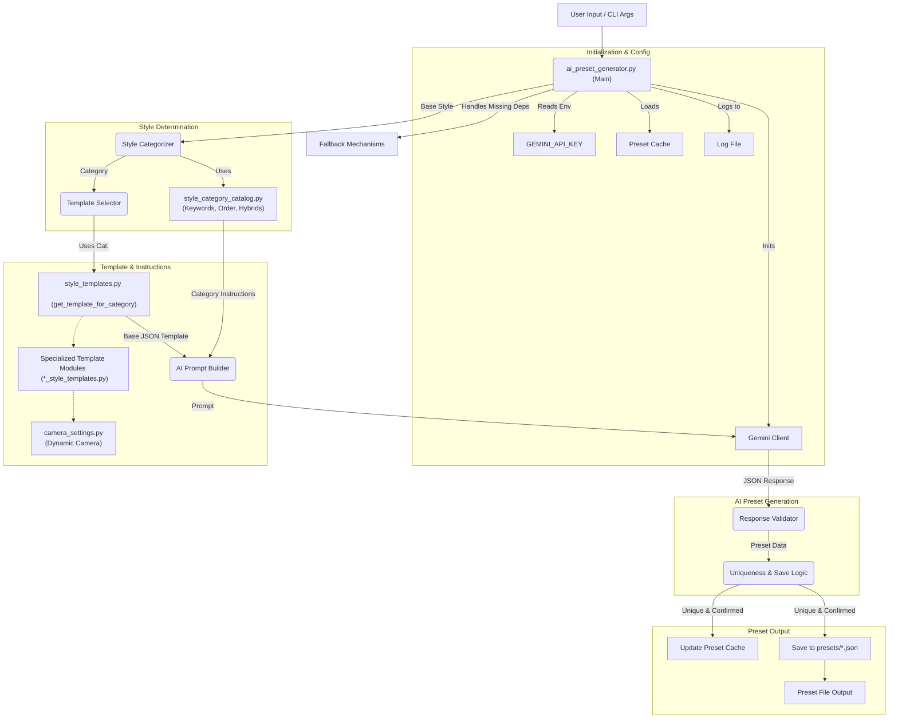

# AI Preset Generator: In-Depth Documentation

[](https://www.python.org/)
[](../LICENSE)

---

## Table of Contents
1.  [Introduction](#introduction)
2.  [Architectural Overview](#architectural-overview)
3.  [Core Components & Functionality](#core-components--functionality)
    *   [3.1. Main Orchestrator (`ai_preset_generator.py`)](#31-main-orchestrator-ai_preset_generatorpy)
    *   [3.2. Style Categorization Engine (`style_category_catalog.py`)](#32-style-categorization-engine-style_category_catalogpy)
    *   [3.3. Style Template System](#33-style-template-system)
    *   [3.4. AI Prompting Strategy](#34-ai-prompting-strategy)
    *   [3.5. Preset Management (Caching & Saving)](#35-preset-management-caching--saving)
4.  [Key Data Structures](#key-data-structures)
    *   [4.1. Style Template Example](#41-style-template-example)
    *   [4.2. `imagen_settings` Structure](#42-imagen_settings-structure)
5.  [Extensibility](#extensibility)
    *   [5.1. Adding a New Style Category](#51-adding-a-new-style-category)
    *   [5.2. Adding a New Style Template](#52-adding-a-new-style-template)
6.  [Dependencies & Configuration](#dependencies--configuration)
7.  [Usage Instructions](#usage-instructions)
    *   [7.1. Command-Line Interface (CLI)](#71-command-line-interface-cli)
    *   [7.2. Interactive Menu](#72-interactive-menu)
8.  [Fallback Mechanisms](#fallback-mechanisms)
9.  [Conclusion](#conclusion)

---

## 1. Introduction

The AI Preset Generator is a Python module designed to dynamically create artistic presets for AI-driven image generation using Google's Gemini AI. It interprets base styles, categorizes them, and uses a system of style templates and category-specific instructions to prompt the Gemini model. The result is a detailed JSON preset for generating stylistically coherent images for a wallpaper generator application. This document outlines its architecture and functionality.

---

## 2. Architectural Overview

The AI Preset Generator processes inputs through several interconnected modules. The diagram below illustrates its architecture:



**Core Workflow Summary:**
The system takes a base style, categorizes it using `style_category_catalog.py`, selects a structural template via `style_templates.py` (which dispatches to specialized modules like `digital_style_templates.py` and uses `camera_settings.py` if needed), builds a detailed prompt for Gemini AI, generates the preset, validates it, checks for uniqueness against a cache, and finally saves it.

---

## 3. Core Components & Functionality

### 3.1. Main Orchestrator (`ai_preset_generator.py`)

This script orchestrates the preset generation process.
*   **Gemini API Integration:** Manages API key retrieval, client initialization, communication, and error handling (retries for rate limits, etc.).
*   **Preset Generation Lifecycle (`generate_ai_preset`):**
    1.  Acquires a base style (user input or AI-generated).
    2.  Categorizes the style via `style_category_catalog.py`.
    3.  Retrieves a base JSON template (via `style_templates.py`) and category-specific instructions.
    4.  Constructs a detailed prompt for Gemini AI.
    5.  Interacts with Gemini, processing the response.
    6.  Validates and refines the preset, merging with template defaults using `deep_update`.
    7.  Checks for uniqueness against `generated_presets_cache.json`.
    8.  Saves confirmed unique presets to the `presets/` directory.
*   **Command-Line Interface (CLI):** Supports arguments like `--style`, `--apply-preset`, and `--auto-save` via `argparse`.
*   **Interactive Menu:** Provides options if no direct CLI generation arguments are given.

### 3.2. Style Categorization Engine (`style_category_catalog.py`)

This module accurately identifies artistic styles and provides AI guidance.
*   **Purpose:** Normalizes and categorizes style names to select appropriate templates and instructions.
*   **Key Data:** Includes `preferred_order` for resolving ambiguities, `hybrid_styles` (token-based), `hybrid_categories_keywords` (phrase-based), and extensive `categories_keywords`.
*   **Categorization Logic (`categorize_style`):** Normalizes input, tokenizes, and matches against defined styles using a prioritized approach.
*   **AI Guidance (`instructions_for_category`):** Provides natural language instructions for each style category, which are embedded in the AI prompt.

### 3.3. Style Template System

This system provides the JSON structure for the AI.
*   **Central Dispatcher (`style_templates.py`):** The `get_template_for_category` function selects and returns the appropriate base template by delegating to specialized modules.
*   **Specialized Template Modules:** Various `*_style_templates.py` files (e.g., `digital_style_templates.py`, `photographic_style_templates.py`, etc.) contain functions that define detailed JSON-like dictionary templates for specific style families.
*   **Template Structure:** Templates define top-level keys (`preset_name`, `moods`, `imagen_settings`, etc.) and provide concrete default values. The crucial `imagen_settings` dictionary holds detailed parameter groups.
*   **Dynamic Camera Settings (`camera_settings.py`):** The `get_dynamic_camera_settings` function supplies realistic camera parameters for photographic and cinematic styles, integrated into their respective templates.

### 3.4. AI Prompting Strategy

Effective AI prompting is key. The prompt includes:
1.  The base style name.
2.  A clear task instruction.
3.  General guidelines (e.g., create unique names, fill all fields, maintain structure, output valid JSON).
4.  Category-specific instructions from `style_category_catalog.py`.
5.  The full JSON template structure for the AI to complete.

This structured approach ensures the AI generates relevant and correctly formatted presets.

### 3.5. Preset Management (Caching & Saving)

*   **Caching (`generated_presets_cache.json`):** An MD5 hash of new presets is checked against this cache to ensure uniqueness and avoid redundant generation. The cache stores recent preset hashes.
*   **Saving (`presets/` directory):** Unique and confirmed presets are saved as `.json` files, named using a cleaned version of the `preset_name` and a timestamp. Saving is handled by `wall_gen.settings_modules.preset_management.save_preset` or a fallback.

---

## 4. Key Data Structures

### 4.1. Style Template Example

A style template is a Python dictionary. Conceptually, for a "Mystic Digital Art" style:
```json
{
  "preset_name": "Mystic Digital Art Preset",
  "moods": ["Ethereal", "Mysterious"],
  "aspect_ratio": "16:9",
  "description": "Preset for ethereal digital art.",
  "imagen_settings": {
    "style_settings": {"art_movement": "Digital Surrealism", "...": "..."},
    "lighting_settings": {"lighting_type": "Emissive Light", "...": "..."},
    "color_settings": {"color_scheme": "Cool Analogous", "...": "..."}
    // ... other imagen_settings groups ...
  }
}
```

### 4.2. `imagen_settings` Structure

This core dictionary within each preset groups detailed parameters:
*   `style_settings`: Art movement, post-processing.
*   `lighting_settings`: Type, quality, direction.
*   `composition_settings`: Technique, focal point.
*   `color_settings`: Scheme, palette type.
*   `detail_settings`: Detail level, texture quality.
*   `environment_settings`: Location, atmospheric effects.
*   `quality_settings`: Resolution, rendering quality.
*   `negative_prompt` & `style_negative_prompt`: Elements to avoid.
*   `camera_settings` (Optional): Detailed camera parameters for photographic styles.
*   Style-specific settings (e.g., `digital_painting_settings`): Parameters unique to certain categories.

---

## 5. Extensibility

### 5.1. Adding a New Style Category

1.  **`style_category_catalog.py`:**
    *   Add to `preferred_order`.
    *   Define in `hybrid_styles` or `hybrid_categories_keywords` if hybrid.
    *   Add keywords to `categories_keywords`.
    *   Provide AI guidance in `instructions_for_category`.

### 5.2. Adding a New Style Template

1.  **Specialized Module:** Create or modify a `*_style_templates.py` file with a new `get_your_new_style_template()` function.
2.  **`style_templates.py`:** Import and call your new function in `get_template_for_category` for the new style name.

---

## 6. Dependencies & Configuration

*   **Python 3.7+** and the `google-generativeai` library (`pip install google-generativeai`).
*   **`GEMINI_API_KEY`:** Must be set as an environment variable.
*   Relies on local project modules within `ai_prest_gen` and potentially a sibling `wall_gen` package.
*   Logging to `ai_preset_generator.log`.
*   Cache file: `generated_presets_cache.json`.
*   Output directory: `presets/`.

---

## 7. Usage Instructions

### 7.1. Command-Line Interface (CLI)

*   Generate for a specific style: `python ai_prest_gen/ai_preset_generator.py --style "Style Name"`
*   Auto-save: Add `--auto-save`
*   Apply existing preset: `python ai_prest_gen/ai_preset_generator.py --apply-preset "preset_name.json"`

### 7.2. Interactive Menu

Run `python ai_prest_gen/ai_preset_generator.py` without style/apply arguments for an interactive menu.

---

## 8. Fallback Mechanisms

`ai_preset_generator.py` includes fallbacks for missing `wall_gen` modules (UI, settings, AI style generator, `save_preset`), allowing reduced functionality. Core `ai_prest_gen` submodules are essential.

---

## 9. Conclusion

The AI Preset Generator offers a robust framework for creating diverse AI image generation presets. Its modular design, detailed style catalog, and structured AI prompting enable high-quality, stylistically tailored outputs.

---

*Refer to source code for further details.*
