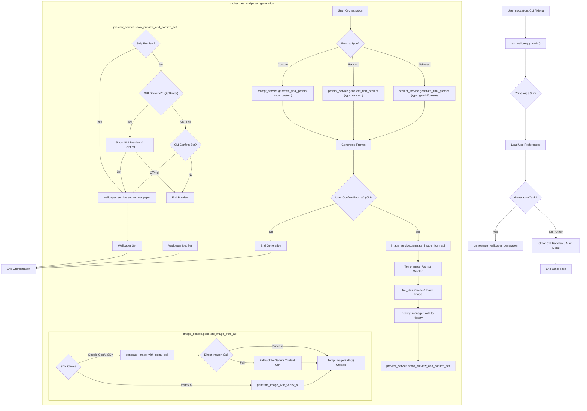
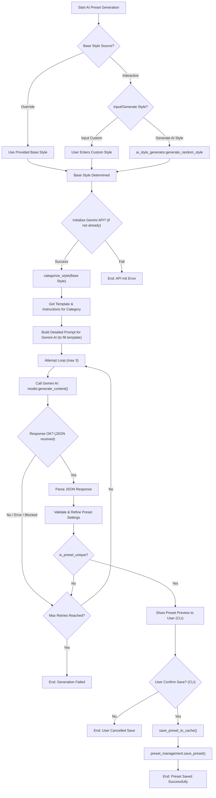

# AI Wallpaper Generator - Project Overview

## Introduction

The AI Wallpaper Generator is a modular Python application designed to create AI-powered wallpapers using Google's Imagen 3 and Gemini API. The project emphasizes modularity, scalability, and extensibility, supporting user preferences, presets, and cross-platform compatibility.

---

## Main Entry Point: `run_wallgen.py`

- Serves as the primary CLI interface and orchestration script.
- Handles command-line arguments for various generation modes, testing, debugging, and image management.
- Initializes logging, user preferences, cache directories, and system dependencies.
- Coordinates the wallpaper generation process by invoking services from the `wall_gen` package.
- Supports AI preset generation and application via CLI options.
- Manages image preview, caching, history logging, and wallpaper setting.
- Implements graceful exit and preference saving on termination.

---

## `wall_gen` Package Structure

The `wall_gen` package contains the core logic and services of the application, organized as follows:

### Core Service Modules

- `prompt_service.py`: Generates and enhances prompts for AI image generation.
- `image_service.py`: Interfaces with AI APIs to generate images from prompts.
- `wallpaper_service.py`: Manages wallpaper setting and related operations.
- `preview_service.py`: Handles image preview and user confirmation workflows.

### Utility Modules

- `app_utils.py`: Application-level utilities including logging and startup routines.
- `cache_utils.py`: Manages cache directories and file caching.
- `file_utils.py`: File operations including image caching and JSON data handling.
- `ui_utils.py`: User interface utilities for CLI interactions and messaging.
- `image_editor.py`: Image manipulation and editing utilities.
- `graceful_exit.py`: Handles clean application shutdown and resource cleanup.

### Configuration

- `config.py`: General configuration constants.
- `gemini_config.py`: Configuration related to Gemini API usage.

### Sub-packages

- `settings_modules/`: Manages user preferences, presets, settings import/export, and menu management.
- `history/`: Tracks generation history and logs.
- `prompt_modules/`: Contains prompt generation components and formatters.
- `preview_backends/`: Supports different GUI backends for image preview (e.g., Qt, Tkinter).

---

## Core Operational Flows

This section outlines the primary logical flows within the application.

### 1. Core Wallpaper Generation Orchestration

The following diagram illustrates the main end-to-end process for generating a wallpaper, from user invocation to the final image being set or saved. This flow is primarily orchestrated by `run_wallgen.py` and involves several core services from the `wall_gen` package.

---

## AI Style Generation: `ai_style_generator.py`

- Provides functionality to generate artistic style descriptions using the Gemini API.
- Implements retry logic with exponential backoff for robust API interaction.
- Supports style categorization and canonicalization for consistent style naming.
- Includes an interactive CLI for generating and saving AI styles.
- Handles API key initialization and error management.

---

## AI Preset Generation: `ai_prest_gen` Package

- Contains the `ai_preset_generator.py` script for generating AI wallpaper presets.
- Uses Gemini API to create coherent random presets based on style categories.
- Employs a restored style categorization logic and consolidated style templates.
- Supports caching of generated presets to avoid duplicates.
- Provides CLI options for generating and applying presets.
- Integrates with the `wall_gen` settings modules for preset management.

### AI Preset Generation Flow Diagram

The following diagram illustrates the process within `ai_prest_gen/ai_preset_generator.py` for creating AI-driven wallpaper presets:

---

## External Dependencies

- `google-generativeai`: For interacting with Google's Gemini API.
- `requests`: HTTP requests handling.
- `pillow`: Image processing.
- `numpy`: Numerical operations.
- `PyQt5`: GUI components for image preview.
- `tinydb`: Lightweight database for storing presets and history.
- Other utilities: `bleach`, `colorama`, `opencv-python-headless`, `rapidfuzz`, `absl-py`, `clrprint`, `scikit-image`.

---

## Design Philosophy

- **Modularity:** Clear separation of concerns with dedicated packages and modules.
- **Service-Oriented Architecture:** Core services encapsulate distinct functionalities.
- **Extensibility:** Supports user preferences, AI-generated styles, and presets.
- **Cross-Platform Support:** Compatible with multiple OS environments.
- **User Interaction:** CLI-driven with options for preview, testing, and customization.
- **Robustness:** Includes error handling, retry mechanisms, and graceful shutdown.

---

## Other Key Features

### 1. Generation History Management

- Stores generation history in a local SQLite database (`wall_gen/history/history.db`).
- Logs date/time, prompts, AI-enhanced prompts, image filenames, user preferences, and output messages.
- Accessible via CLI commands to review past generations.
- Facilitates recall, debugging, and creative tracking.

### 2. Image Editing Capabilities

- Provides programmatic image manipulation using Pillow, OpenCV, and Scikit-image.
- Supports undo/redo, selection masks, and various filters and adjustments.
- Includes placeholders for advanced AI-based enhancements.

### 3. Cross-Platform Wallpaper Setting

- Detects OS and desktop environment to set wallpaper automatically.
- Supports Windows, macOS, and various Linux desktop environments.
- Uses native APIs or command-line tools for wallpaper application.
- Includes fallback mechanisms for unknown environments.

---

## Summary

This project combines advanced AI capabilities with a well-structured Python codebase to deliver a flexible and powerful wallpaper generation tool. The modular design facilitates maintenance, testing, and future enhancements.

---

*End of Project Overview*
